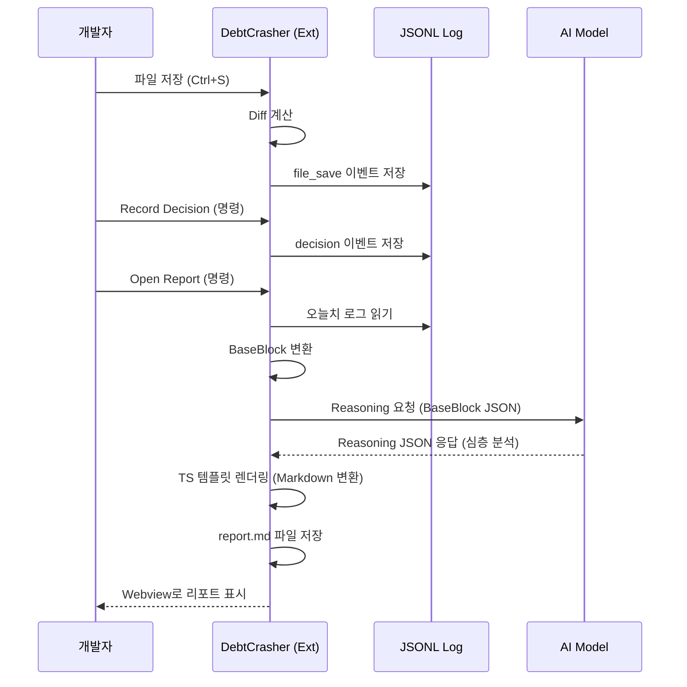

# DebtCrasher 프로젝트 현황 및 개발 문서 (2026-01-12 기준)

이 문서는 DebtCrasher VS Code 확장 프로그램의 현재 구현 상태, 아키텍처, 내부 로직을 상세하게 기술합니다. 현재 MVP(Minimum Viable Product) 단계의 개발이 완료되었으며, **Single-Stage Reasoning 파이프라인**으로의 리팩터링이 적용된 상태입니다.

---

## 1. 프로젝트 개요

**DebtCrasher**는 AI 코딩 도구(Copilot, Claude 등) 사용 시 발생하는 **"기억 부채(Memory Debt)"** 문제를 해결하기 위한 도구입니다. 코드는 남지만 "왜 이렇게 짰는지"에 대한 사고 과정이 휘발되는 것을 막기 위해, 개발 로그를 자동으로 수집하고 이를 분석하여 **"사람이 읽기 좋은 교육용 리포트"**로 변환합니다.

## 2. 현재 아키텍처 (Layer A + Layer B)

시스템은 로그를 쌓는 **Layer A**와 이를 분석해 리포트를 만드는 **Layer B**로 명확히 분리되어 구현되었습니다.

### 🟢 Layer A: Structured Logging (구현 완료)
개발자의 활동을 방해하지 않고(Zero-Friction) 백그라운드에서 데이터를 수집합니다.

*   **구현 파일**: `src/logging.ts`
*   **저장 포맷**: JSON Lines (`.devcrasher/logs/YYYY-MM-DD-N.jsonl`)
*   **주요 기능**:
    1.  **자동 파일 저장 감지 (`file_save`)**:
        *   VS Code의 `onDidSaveTextDocument` 훅을 사용합니다.
        *   `diff` 라이브러리를 사용하여 이전 저장 시점 대비 **추가됨/삭제된 라인 수**를 계산합니다.
        *   `.git`, `node_modules` 등 불필요한 경로는 필터링됩니다.
    2.  **수동 의사결정 기록 (`decision`, `bugfix`)**:
        *   명령 팔레트(`F1`)를 통해 짧은 메모를 남길 수 있습니다.
        *   현재 활성화된 파일 경로와 라인 번호를 컨텍스트로 함께 저장합니다.
    3.  **AI 노트 생성 (`ai_note`)**:
        *   현재 작업 중인 파일의 `git diff` 또는 변경 내역을 수집합니다.
        *   가벼운 LLM 모델(예: GPT-4o-mini)을 호출하여 "지금 무슨 작업을 했는지" 요약본을 생성하고 로그에 저장합니다.

### 🟢 Layer B: Narrative Reporting (구현 완료)
쌓인 로그를 기반으로 '읽고 싶어지는' 문서를 생성합니다. 기존의 2단계(Outline → Detail) 방식에서 **단일 추론 + 템플릿 렌더링** 방식으로 고도화되었습니다.

*   **구현 파일**: `src/report.ts`, `src/aiClient.ts`
*   **파이프라인 단계**:
    1.  **BaseBlock 구성**:
        *   하루치 로그(`LogEvent[]`)를 읽어와 LLM이 이해하기 쉬운 `BaseBlock` 형태로 정제합니다.
        *   단순 파일 저장 로그는 작업 흐름의 '시점'을 제공하고, `ai_note`나 `decision` 로그는 '내용'을 제공합니다.
    2.  **Reasoning (단일 고성능 LLM 호출)**:
        *   `src/aiClient.ts`의 `generateReportReasoning` 함수가 수행합니다.
        *   **프롬프트 전략**: 단순히 요약하는 것이 아니라, "시니어 엔지니어가 멘토링하듯이" 분석하도록 지시합니다. (배경, 대안, 트레이드오프, 함정 분석)
        *   **출력 포맷**: 자연어 텍스트가 아닌, 엄격한 **JSON 포맷**(`ReasoningJson`)으로 응답을 받습니다.
    3.  **TypeScript Template Rendering**:
        *   LLM이 생성한 JSON 데이터를 `src/report.ts`의 렌더러가 받아 Markdown으로 변환합니다.
        *   **특징**:
            *   번호 매기기(1, 2, 3...)를 통한 가독성 높은 구조.
            *   "왜 이렇게 선택했나요?", "관련 개념/주의 포인트" 등 교육적 섹션 배치.
            *   전체 요약 및 체크리스트 자동 생성.
    4.  **Webview & Export**:
        *   `src/webview.ts`를 통해 VS Code 내부에서 Notion 스타일의 미리보기를 제공합니다.
        *   **Export HTML**: 브라우저용 HTML 파일로 내보내 문서를 영구 소장하거나 PDF로 인쇄할 수 있습니다.

---

## 3. 상세 설정 가이드 (Settings)

VS Code의 설정 UI(`Ctrl + ,`)에서 `debtcrasher`를 검색하여 손쉽게 설정할 수 있도록 `package.json`에 스키마가 정의되어 있습니다.

| 설정 항목 | ID | 기본값 | 설명 |
| :--- | :--- | :--- | :--- |
| **API 키** | `debtcrasher.providers.*.apiKey` | - | OpenAI, Gemini, DeepSeek 중 사용하는 공급자의 키 입력 |
| **리포트 모델** | `debtcrasher.report.reasoningModel` | provider별 기본값 | 리포트 분석에 사용할 고성능 모델 (예: `gpt-4o`, `gemini-1.5-pro`) |
| **노트 모델** | `debtcrasher.note.model` | `gpt-4o-mini` | AI 노트 생성용 가볍고 빠른 모델 |
| **자동 생성** | `debtcrasher.autoGenerateOnSave` | `true` | 파일 저장 시 AI 노트 자동 생성 여부 |

---

## 4. 수행 가능한 작업 (Commands)

현재 구현되어 바로 실행 가능한 명령어 목록입니다. (`F1` 키를 눌러 실행)

1.  **`DebtCrasher: Open Report`**
    *   기능: 오늘 저장된 로그를 분석하고 리포트를 생성하여 엽니다.
    *   출력: Webview 패널 (우측 하단 Export 버튼 포함)
2.  **`DebtCrasher: Record Decision`**
    *   기능: 중요한 기술적 의사결정을 기록합니다. (예: "Redux 대신 Zustand 사용 결정")
3.  **`DebtCrasher: Record Bugfix`**
    *   기능: 버그 수정 내역을 기록합니다. (예: "Null check 누락으로 인한 런타임 에러 수정")
4.  **`DebtCrasher: Generate AI Note`**
    *   기능: 현재 파일의 변경 사항을 AI가 분석하여 로그에 추가합니다.

---

## 5. 데이터 흐름 (Data Flow)

---

## 6. 개발 상태 요약

*   ✅ **기반 구조**: Logging, JSONL IO, Directory Management 
*   ✅ **LLM 연동**: OpenAI/Gemini/DeepSeek API Client 구현 (Reasoning JSON 모드 지원)
*   ✅ **리포트 로직**: Single-Stage Reasoning + TypeScript Rendering 파이프라인 완성
*   ✅ **UI/UX**: 명령어 등록, 설정 UI 스키마, Webview Viewer, HTML Export
*   ✅ **문서화**: README, DEV.md 업데이트 완료

**현재 상태는 MVP 릴리즈가 가능한 수준이며, `npm run build`를 통해 빌드가 성공적으로 수행됨을 확인했습니다.**
